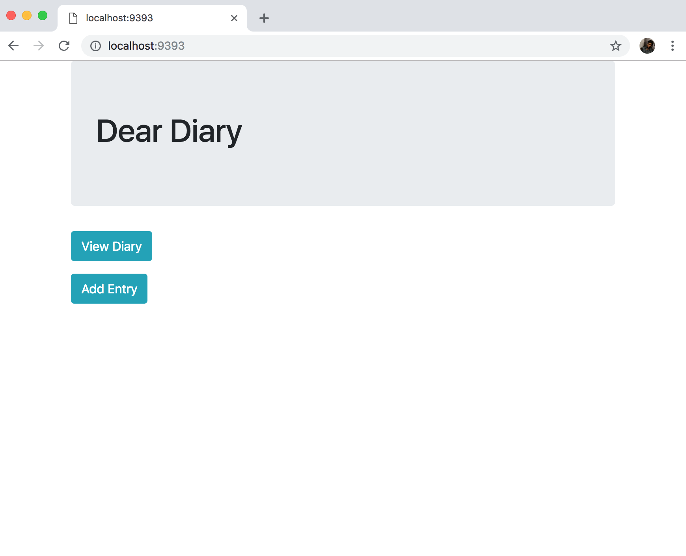
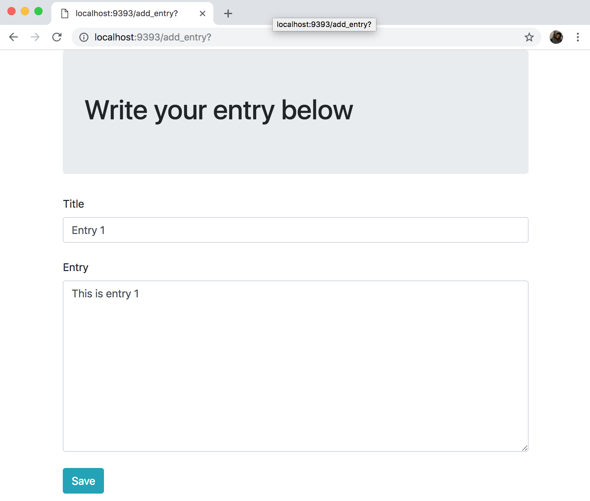
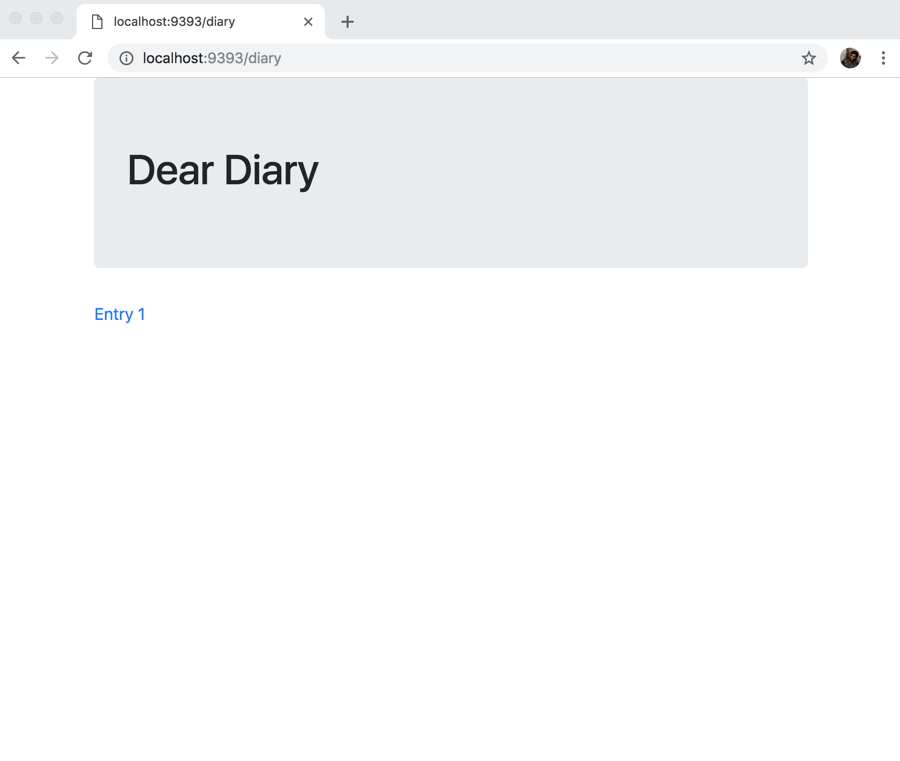
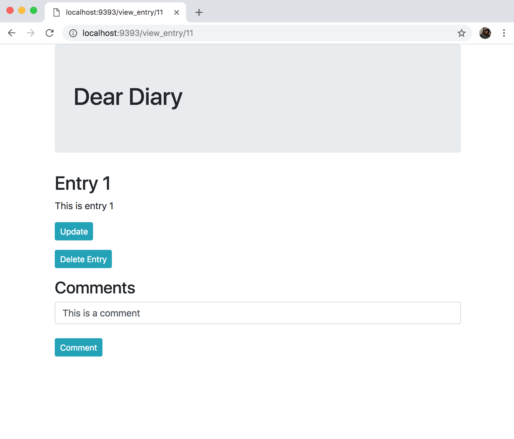
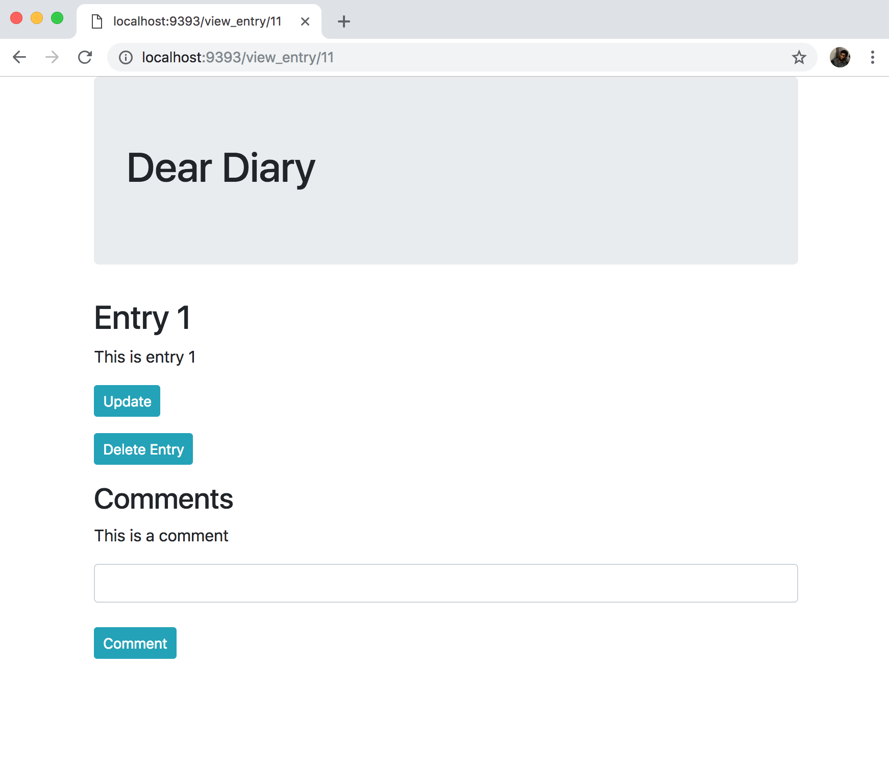
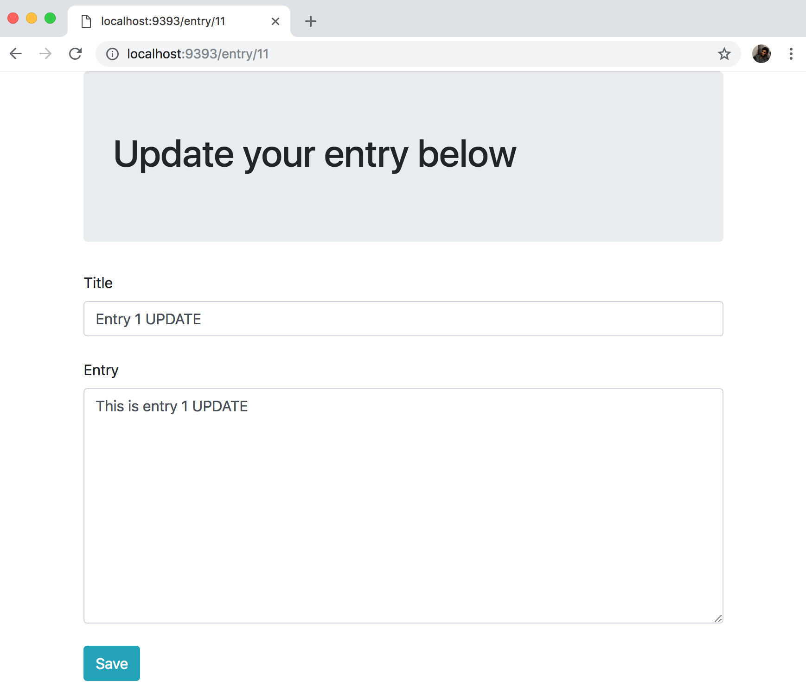
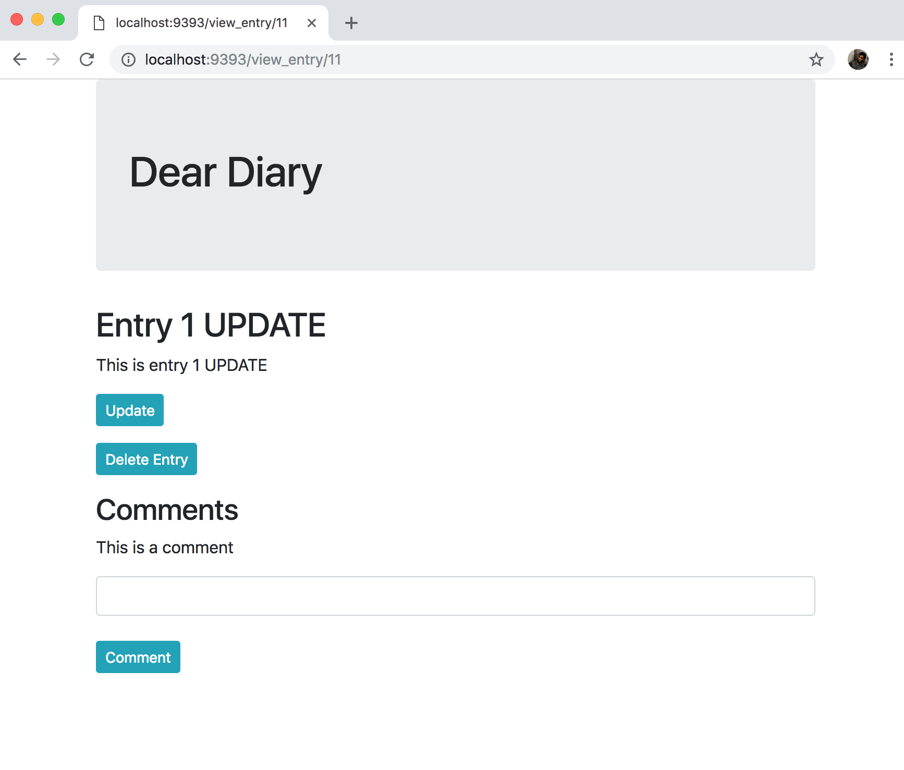

# Dear Diary

## About The Program
This is a program that mimics a real diary. Users are able to add diary entries (stored in chronological order) and later view them. Diary entries can be updated at any time or deleted. There is also a feature to add comments specific to diary entries once they have been saved.

The application was built from user stories provided by coaches at Makers Academy. It has an MVC architecture connected to a postgreSQL database. TDD practices were followed during the building of program; the user stories were broken down into feature tests I expected the user to be able to carry out. The error messages from the tests were then able to inform that code that needed to be written.

The program also follows as OOD where each responsibilit has been separated out into its own class. This should allow any future changes or additional functionality to be added with minimal impact to the rest of the codebase.

## Installation
### Database
1. Run `brew install postgresql`
2. Run `psql postgres`
3. `CREATE TABLE diary;`
4. In `./db/migrations` executes the files in order to create the neccesary tables

### Dear Diary
1. Clone this repo
2. `cd` into the directory
3. Run `bundle` to install the required rubygems
4. Run `rackup`
5. Visit `http://localhost:9292` in your web browser

## Example Usage
### Adding a Diary Entry

- Click 'Add Entry'

- Fill in the fields and press 'save'

### Adding Comments

- Click on an entry

- Fill in field with comment an press 'Comment'

### Updating an Entry

- Click 'Update'

- Make the updates you require and press 'save'

